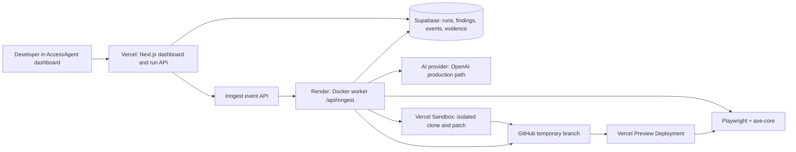

# AccessAgent

**A closed-loop accessibility remediation agent.** AccessAgent audits a rendered website, proposes source-level fixes in an isolated environment, re-renders the changed preview, and only opens a pull request when the recorded evidence verifies the fixes.

It is deliberately more than an accessibility scanner. A scanner can report a broken image alternative or unlabeled form field; AccessAgent carries that finding through a real browser audit, a disposable code branch, a test run, a deployment preview, and a second browser inspection before it makes a verification claim.

## Team

- Mohammed Ayaan Adil Ahmed
- Elif İpek Aktaş

## What is implemented

| Capability | What AccessAgent does |
| --- | --- |
| Rendered audit | Crawls an authorized same-origin site within page/depth limits, captures screenshots and an accessibility-tree snapshot, and runs axe-core. |
| Visual review | Sends screenshot, accessibility context, and static findings through a structured AI-provider contract to identify visual barriers such as insufficient contrast. |
| Safe source changes | Clones the configured repository into Vercel Sandbox, works only on a new `accessagent/run-*` branch, and never writes to `main`. |
| Test + preview gate | Runs the configured repository test command, pushes the temporary branch, then waits for its Vercel Preview Deployment. |
| Verification | Re-audits the preview, compares before/after screenshots, stores evidence, and labels each original finding as verified or needing review. |
| Pull request | Opens one GitHub PR only when every patch in the batch verifies; the branch includes the evidence files. |
| Durable workflows | Uses Inngest for retries, long-running orchestration, scheduled rescans, and retention cleanup. |
| Evidence dashboard | Shows a live trace, findings, diffs, screenshots, contrast chips, stored evidence, and scheduled-rescan state. |

The controlled `/demo-target` is intentionally inaccessible so that the full loop can be demonstrated safely. It is not an implementation example.

## How Codex and GPT-5.6 are used

### Codex + GPT-5.6 Terra: the development and verification environment

Codex, using GPT-5.6 Terra for this build, was used to turn the product specification into this working system: it inspected the repository, implemented the Next.js, Supabase, Inngest, browser-audit, sandbox, and GitHub integrations; ran type/unit checks; reviewed diffs; and iterated on deployment and runtime failures. That mirrors the core product thesis: make a source change, run real checks, and inspect the outcome rather than trusting an untested edit.

### GPT-5.6: the intended high-capability reasoning and visual-review model

AccessAgent's runtime calls the OpenAI Responses API for three bounded tasks: visual accessibility inspection, source-edit proposal, and post-preview verification. When an OpenAI project provides a GPT-5.6 model identifier, set `OPENAI_VISION_MODEL` and `OPENAI_PATCH_MODEL` to that identifier to use it for those roles. Playwright—not the model—controls the browser, captures screenshots, and runs axe-core; the model receives the resulting evidence and must return schema-validated structured output.

The committed default is currently `gpt-5-mini` to keep a hackathon proof affordable. This is intentional model tiering, not a claim that every run used GPT-5.6. The workflow, evidence gates, sandbox, and verification behavior stay the same when the configured OpenAI model changes.

## The idea in one minute

```text
Broken deployed page
       |
       v
Playwright + axe-core + visual inspection find real barriers
       |
       v
AI patch role proposes minimal source edits in an isolated sandbox branch
       |
       v
Configured tests pass -> branch gets a Vercel Preview Deployment
       |
       v
Playwright re-renders and re-audits that preview
       |
       +--> any unresolved/regressed issue: retry (maximum 3) or needs human review
       |
       `--> every issue verified: evidence is committed and a GitHub PR is opened
```

The central product rule is simple: **a diff is not proof**. A finding is only marked verified after fresh browser-derived evidence exists for the deployed patch preview.

## Architecture



### Deployment responsibilities

| Service | Responsibility | Important boundary |
| --- | --- | --- |
| Vercel | Public Next.js dashboard, GitHub sign-in, `POST /api/runs`, Vercel Preview Deployments, and Sandbox control plane. | It queues audit events; it does **not** run the durable browser/AI workflow. |
| Render | Docker worker with the Playwright-capable Chromium runtime and the Inngest function endpoint. | Holds AI, signing, patching, GitHub, and preview credentials. |
| Inngest | Durable workflow execution, retries, cron triggers, run timeline. | It must be synced to the **Render** endpoint, not the Vercel endpoint. |
| Supabase | GitHub OAuth session support, Postgres run history, Realtime dashboard data, private screenshot/evidence storage, and rate limiting. | Browser code uses only the publishable key; the secret key stays server-side. |
| GitHub | Repository source, short-lived patch branches, stored evidence, and final PR. | The fine-grained token needs Contents and Pull requests read/write access. |

### Critical Inngest deployment rule

The Inngest Vercel integration must be disconnected for this project. That integration can automatically resync `/api/inngest` back to a Vercel deployment whenever Vercel deploys, replacing the Render worker endpoint. The intended active URL is:

```text
https://<render-worker>.onrender.com/api/inngest
```

Vercel needs `INNGEST_EVENT_KEY` to send events. Render needs both `INNGEST_EVENT_KEY` and `INNGEST_SIGNING_KEY` because it serves and executes the signed workflows.

## How the system works, bottom-up

### 1. User interface and API ingress

The frontend is Next.js 15 and React 19. It renders the run trace, evidence, findings, patch attempts, before/after pairs, and rescan controls. The design uses a high-contrast ink/paper palette and ratio chips because the product interface should meet the standard it asks other sites to meet.

When a user starts an audit, `POST /api/runs` validates that the target is an authorized, safe public URL; applies the per-hour audit limit; creates a queued Supabase run; and sends `accessagent/audit.requested` to Inngest. If `ACCESSAGENT_REQUIRE_AUTH=true`, GitHub OAuth through Supabase is required before the run can start.

This Vercel ingress route intentionally checks only its own needs: Supabase and the Inngest event key. It does not need an AI key or an Inngest signing key.

### 2. Durable multi-stage orchestration

Inngest receives the event and calls the worker endpoint hosted on Render. `audit-patch-verify` retains state across browser work, AI calls, sandbox work, preview deployment waits, retries, and errors. The stages are represented in the UI as:

1. Crawl + audit
2. Visual inspection
3. Patch proposal
4. Re-render
5. Verification

The workflow retries provider-rate-limit errors and uses a hard maximum of three patch/preview/verification attempts. A run that cannot prove all fixes is never presented as successful and never opens a PR.

Two additional Inngest workflows exist:

- `scheduled-rescan` runs daily at `02:00` UTC and queues due rescan records.
- `retention-cleanup` runs daily at `02:30` UTC and removes stale runs/evidence according to `ACCESSAGENT_RETENTION_DAYS`.

### 3. Rendered browser audit

The worker launches Playwright Chromium against the target URL. It stays on the same origin and is bounded by configured page and depth caps. For each visited page it collects:

- full-page screenshot evidence;
- a compact accessibility-tree snapshot;
- axe-core baseline findings; and
- a small DOM fallback for common missing-alternative, label, button-name, and link-name cases when browser injection cannot produce a normal axe result.

The browser implementation uses the standard Playwright Chromium runtime on Render. Its Vercel-compatible path uses `@sparticuz/chromium` with constrained GPU options, but the Render Docker worker is the production browser executor because it has a full Playwright image.

### 4. Static and visual findings

`@axe-core/playwright` provides the deterministic rules baseline. The visual inspection role receives the screenshot, accessibility context, and static results through a strict JSON schema and validates the response with Zod. It augments—not replaces—the browser audit with visual barriers that static DOM rules may not catch, such as contrast problems.

Findings retain their WCAG reference, selector/context, impact, plain-language explanation, and evidence relationship. The workflow merges and prioritizes them by user impact before attempting source changes.

### 5. Provider abstraction

The runtime has one structured provider interface for visual inspection, verification, and patch edits.

- **OpenAI is the production default.** It uses the OpenAI Responses API through the `openai` SDK.
- **Gemini is an isolated test adapter.** It uses Google GenAI Interactions with `store: false` and the same Zod-validated output shape.

The provider never receives authority to write directly into the repository. Its patch output is a structured list of `path`, `oldText`, and `newText` edits, which the sandbox validates before applying.

### 6. Isolated patching and tests

The patch stage starts a Vercel Sandbox, clones `ACCESSAGENT_REPO_URL`, and creates a fresh branch named like:

```text
accessagent/run-<timestamp>-attempt-<n>
```

It inventories the relevant project files, asks the patch role for bounded edits, then accepts an edit only when it targets a permitted relative file and its old text matches once. It also runs `git diff --check` and the human-configured `ACCESSAGENT_TEST_COMMAND` before it commits and pushes.

For the controlled high-frequency findings, there is a narrowly scoped deterministic fallback: add a missing `alt`, add a form control label/`aria-label`, or strengthen a known low-contrast literal. That fallback runs only after model edits fail and only inside source files in the clone; it still goes through the same test, preview, and verification gates.

### 7. Preview and verification

Once the temporary branch is pushed, AccessAgent asks Vercel for the branch preview and waits for it to become ready. It then repeats the browser audit against that preview.

Verification does not trust a model response alone:

- a fresh axe result is authoritative for axe-originated issues; and
- the visual verifier compares the before screenshot, after screenshot, accessibility-tree evidence, and target finding for visual issues.

If an original issue has disappeared from the fresh relevant audit and no regression is found, it is marked **Verified**. Otherwise it is reviewed again in the next bounded attempt or remains **Review / needs human review**.

### 8. Evidence and pull request

Supabase persists runs, findings, patch attempts, run events, rescan records, and screenshot references. When all fixes verify and `ACCESSAGENT_PUBLISH_PR_EVIDENCE=true`, the PR stage commits the before/after evidence into `.accessagent/evidence/<run-id>/` on the temporary branch and opens one GitHub PR to `GITHUB_BASE_BRANCH` (normally `main`).

AccessAgent never pushes to `main`, never auto-merges, and never opens a PR containing unverified findings.

## Technology stack

| Area | Technologies |
| --- | --- |
| Frontend/API | Next.js 15, React 19, TypeScript |
| Durable agent workflow | Inngest |
| Browser audit | Playwright, `@axe-core/playwright`, axe-core, `@sparticuz/chromium` for constrained serverless compatibility |
| AI | OpenAI Responses API (`openai` SDK) by default; optional Google GenAI adapter for isolated testing |
| Data and auth | Supabase Postgres, Storage, Realtime, SSR auth, GitHub OAuth |
| Sandboxed code execution | Vercel Sandbox |
| Preview deployment lookup | Vercel API |
| Git + PR automation | Octokit / GitHub REST API |
| Validation | Zod, TypeScript type checking, Node test runner, Playwright e2e support |
| Worker runtime | Docker image based on Microsoft Playwright, deployed to Render |

## Local development

### Prerequisites

- Node.js 20+ and npm
- Supabase project with migration applied
- Inngest account/app
- GitHub OAuth configured in Supabase (if sign-in is enabled)
- Vercel project connected to the target GitHub repository
- Render Docker Web Service for the worker

### Run it

```bash
copy .env.example .env.local
npm install
npm run dev
```

Open `http://localhost:3000`. The live, production-equivalent path requires the service configuration described below; the dashboard itself can be explored without starting an audit.

### Validate the repository

```bash
npm run test
npm run test:e2e
npm run build
```

`npm run test` performs TypeScript checking plus unit tests. Browser e2e tests require the relevant local browser dependencies.

## Configuration and deployment

Copy `.env.example` to `.env.local` for local work. Never commit `.env.local`, provider keys, GitHub tokens, Supabase secret keys, or Vercel tokens.

### Required on Vercel (dashboard/ingress)

| Variable | Purpose |
| --- | --- |
| `NEXT_PUBLIC_APP_URL` | Public dashboard URL. |
| `NEXT_PUBLIC_SUPABASE_URL` | Supabase project URL. |
| `NEXT_PUBLIC_SUPABASE_PUBLISHABLE_KEY` | Browser-safe Supabase key. |
| `SUPABASE_SECRET_KEY` | Server-side Supabase access for the ingress/data path. |
| `INNGEST_EVENT_KEY` | Sends audit events to Inngest. |
| `ACCESSAGENT_REQUIRE_AUTH` | Set to `true` to require GitHub sign-in. |
| optional limits | `ACCESSAGENT_MAX_PAGES`, `ACCESSAGENT_MAX_DEPTH`, `ACCESSAGENT_AUDITS_PER_HOUR`. |

Do **not** put `INNGEST_SIGNING_KEY`, `OPENAI_API_KEY`, `GEMINI_API_KEY`, GitHub token, or Vercel Sandbox credentials on Vercel for this split architecture. Those belong to the worker.

### Required on Render (worker)

Render uses the committed `Dockerfile` and `render.yaml` as the worker definition. Set the health check to `/api/health`, and set these values in the Render service:

| Group | Variables |
| --- | --- |
| Inngest | `INNGEST_EVENT_KEY`, `INNGEST_SIGNING_KEY` |
| Supabase | `NEXT_PUBLIC_SUPABASE_URL`, `NEXT_PUBLIC_SUPABASE_PUBLISHABLE_KEY`, `SUPABASE_SECRET_KEY` |
| AI | `ACCESSAGENT_AI_PROVIDER`, provider API key, provider model values |
| Repository/PR | `ACCESSAGENT_REPO_URL`, `ACCESSAGENT_TEST_COMMAND`, `ACCESSAGENT_PUBLISH_PR_EVIDENCE`, `GITHUB_TOKEN`, `GITHUB_OWNER`, `GITHUB_REPO`, `GITHUB_BASE_BRANCH` |
| Sandbox + preview | `VERCEL_TOKEN`, `VERCEL_PROJECT_ID`, `VERCEL_TEAM_ID` |
| Limits/operations | `ACCESSAGENT_MAX_PAGES`, `ACCESSAGENT_MAX_DEPTH`, `ACCESSAGENT_MAX_ATTEMPTS`, `ACCESSAGENT_RETENTION_DAYS`, optional `ACCESSAGENT_ALERT_WEBHOOK_URL` |

For a target repository, use a test command that starts from a clean clone, for example:

```text
npm ci --legacy-peer-deps && npm run test
```

### Supabase setup

1. Run [`supabase/migrations/001_initial.sql`](supabase/migrations/001_initial.sql) in the Supabase SQL editor. Choose **Run and enable RLS** if prompted.
2. Configure GitHub as an OAuth provider in Supabase Auth if `ACCESSAGENT_REQUIRE_AUTH=true`.
3. Add both local and deployed `/auth/callback` redirect URLs to Supabase.
4. Use a publishable key in `NEXT_PUBLIC_SUPABASE_PUBLISHABLE_KEY`; keep `SUPABASE_SECRET_KEY` server-only.

### GitHub setup

Create a fine-grained GitHub token scoped to the target repository with:

- Contents: Read and write
- Pull requests: Read and write

Set `ACCESSAGENT_REPO_URL` to the clone URL of that repository. AccessAgent creates temporary `accessagent/run-*` branches, pushes them, and opens PRs to `GITHUB_BASE_BRANCH`. After reviewing the result, keep the branch backing an open PR and delete stale failed/abandoned `accessagent/run-*` branches from GitHub.

### Inngest setup

1. Put the event and signing keys into Render; put only the event key into Vercel.
2. In Inngest, manually sync the active app to the Render endpoint:

   ```text
   https://<render-worker>.onrender.com/api/inngest
   ```

3. Confirm Inngest lists three functions: audit/patch/verify, scheduled rescan, and retention cleanup.
4. Do not enable the Vercel Inngest integration for this project; it will overwrite the active Render sync after Vercel deployments.

## Provider selection

### Production: OpenAI

Set these **on Render**:

```dotenv
ACCESSAGENT_AI_PROVIDER=openai
OPENAI_API_KEY=your_project_api_key
OPENAI_VISION_MODEL=gpt-5-mini
OPENAI_PATCH_MODEL=gpt-5-mini
```

`ACCESSAGENT_AI_PROVIDER` defaults to `openai`, so the explicit value is useful for clarity but not required. After changing Render environment values, redeploy the Render worker. Keep the Inngest app synchronized to Render.

### Isolated test provider: Gemini

Gemini is available only as an alternative testing adapter:

```dotenv
ACCESSAGENT_AI_PROVIDER=gemini
GEMINI_API_KEY=...
GEMINI_VISION_MODEL=...
GEMINI_PATCH_MODEL=...
```

For a bounded proof run, use `ACCESSAGENT_MAX_PAGES=1` and `ACCESSAGENT_MAX_DEPTH=0`. Switch back to `openai` for the intended production configuration. The inactive provider key is not used.

## Safety and operating constraints

- Audit only sites you own or have explicit authorization to test.
- URL checks reject unsafe/local/private targets before an audit is queued.
- Browser crawling remains same-origin and is capped by page/depth limits.
- Generated edits run in a disposable sandbox clone and a new branch; the primary checkout and `main` are never patch targets.
- A repository test command and preview deployment are mandatory gates before verification.
- Evidence is private in Supabase and is attached to the patch branch only when PR evidence publishing is explicitly enabled.
- No unresolved or inconclusive issue is called verified. The result is a review state, not a false success.

## Troubleshooting

| Symptom | Likely cause and correction |
| --- | --- |
| Inngest changes back to a Vercel URL | Disconnect the Vercel Inngest integration, then resync Inngest manually to the Render `/api/inngest` URL. |
| `Live audits are unavailable ... INNGEST_SIGNING_KEY` on Vercel | The Vercel ingress should not require it. Ensure the current code is deployed and set the signing key on Render instead. |
| `401 Event key not found` | Use the event key from the same Inngest environment on both Vercel and Render, then redeploy the affected service. |
| Browser executable/Chromium errors on Vercel | The durable workflow must run from the Render Docker worker, not from Vercel. |
| Sandbox rejects a patch | This is a safe failure: the edit did not meet exact-match, diff, or test gates. The workflow retries within its attempt limit and otherwise marks review. |
| Patch preview does not appear | Confirm the target repository is connected to Vercel and the Render worker has a valid `VERCEL_TOKEN`, `VERCEL_PROJECT_ID`, and `VERCEL_TEAM_ID`. |
| OpenAI 429/quota error | The API project needs active billing/available credits and must be within its model rate limits; creating another key inside the same unfunded project does not add quota. |

## Scope and roadmap

AccessAgent is designed for web accessibility remediation and does not claim legal certification or complete WCAG AAA coverage. The next practical improvements are broader interactive keyboard/focus testing, richer issue-to-source mapping, team/organization controls, configurable policy gates, and more production observability/cost controls.

## License

No license has been declared for this repository yet.
